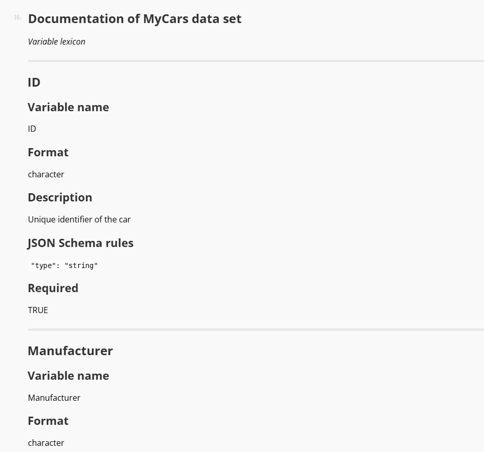
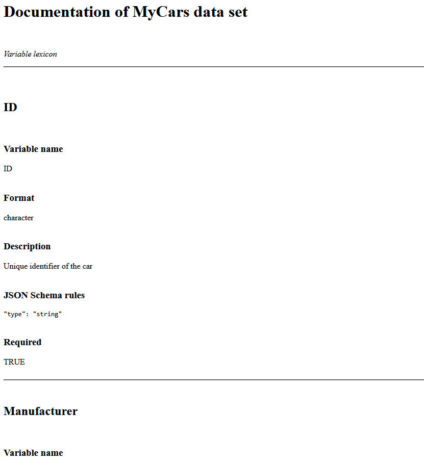
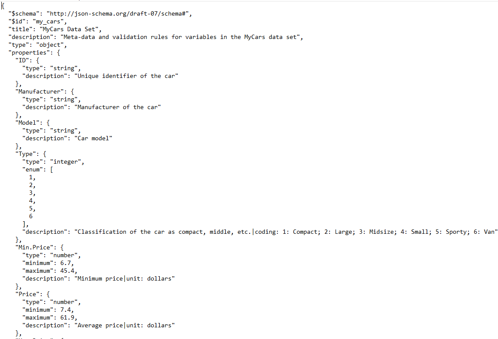

# jsonDF
Metadata management and conversions Between R Data Frames, JSON Schemas, JSON data files, and markdown/HTML/SQL code

## Summary 

Metadata management is getting increasingly important also for data analysts, statisticians, and bioinformaticians. 
Documenting of data frames and variables as well as validation of data frame's records are crucial for efficient handling of metadata in your analysis pipelines. 

The `jsonDF` package facilitates generation of documentation of variables in R data frames, their validation via [JSON Schemas](https://json-schema.org/), and conversion between data frames and JSON data files. 
Tools for rendering variable documentation as markdown and HTML files accessible to your collaborators and customers are provided as well. 

## Remarks

The `data.frame` - `JSON` - `JSON Schema`, `data.frame` - `documentation` - `documentation Markdowm/HTML` conversion tools are more or less ready. 
Working on SQL code generators given variable documentation of a JSON Schema. 

## Terms of use

The package is available under a [GPL-3 license](https://github.com/PiotrTymoszuk/fastTest/blob/main/LICENSE). 
The package is being developed in collaboration with [Health Data Research Hub at the Medical University of Innsbruck](https://www.i-med.ac.at/forschung/Forschungsdatenmanagement/Forschungsdatenmanagement.html).

## Contact

The package maintainer is [Piotr Tymoszuk](mailto:piotr.s.tymoszuk@gmail.com).

## Acknowledgements

We thank authors, maintainers, and contributions of the following R packages: 
[tidyverse](https://www.tidyverse.org/), 
[furrr](https://furrr.futureverse.org/), 
[future](https://future.futureverse.org/), 
[jsonlite](https://github.com/jeroen/jsonlite), 
[jsonvalidate](https://github.com/ropensci/jsonvalidate), 
[rlang](https://rlang.r-lib.org/), and 
[stringi](https://stringi.gagolewski.com/index.html). 

## Basic usage

To demonstrate basic functions of the package, a derivative of the `Cars93` data set from `MASS` package will be used. 
The data set comes as a data frame together with our `jsonDF` package. 
In addition, the `tidyverse` package bundle and the`stringi` package will be used for operations on data frames and text. 
Package `furrr` will parallelize some validation steps.

```r 

  library(tidyverse)
  library(stringi)

  library(jsonDF)

  library(furrr)
  
```

```
>   my_cars[1:5, 1:5]

# A tibble: 5 × 5
  ID            Manufacturer Model   Type    Min.Price
  <chr>         <chr>        <chr>   <fct>       <dbl>
1 Acura_Integra Acura        Integra Small        12.9
2 Acura_Legend  Acura        Legend  Midsize      29.2
3 Audi_90       Audi         90      Compact      25.9
4 Audi_100      Audi         100     Midsize      30.8
5 BMW_535i      BMW          535i    Midsize      23.7

```

### Exploratory analysis, documentation of variables in a data frame, and coding schemes for enumerated features

<details>

#### Exploratory analysis

To obtain basic descriptive statistics of numeric, logical, factor, and character variables in the data frame, `get_stat()` function is called. 
For numeric and date variables, the function computes medians with interquartile ranges (IQR) and ranges. 
For enumerated variables, i.e. variables with fixed categories, percentages of complete observations and counts of records in the category are returned. 

Of note, factors are always regarded as enumerated variables, whose categories correspond to factor's levels and internally coded as integers. 
Following the R's convention, the first level is coded as 1, the second as 2 and so on. 
`enum_limit` argument specifies if and how non-factor variables with few unique values will be treated. 
For `enum_limit = 7` in the example below, character and numeric variables with no more than seven unique values will be treated as enumerated features. 
This concerns e.g. the variable named `Cylinder_number` and originally specified as a numeric feature.

```r

  car_stats <- my_cars %>%
    get_stats(enum_limit = 7,
              signif_digits = 3)

```

```
> car_stats[1:10, ]

# A tibble: 10 × 3
   variable     format    statistic                                                                                               
   <fct>        <chr>     <chr>                                                                                                   
 1 ID           character "complete: n = 93"                                                                                      
 2 Manufacturer character "complete: n = 93"                                                                                      
 3 Model        character "complete: n = 93"                                                                                      
 4 Type         factor    "Compact: 17.2% (n = 16)\nLarge: 11.8% (n = 11)\nMidsize: 23.7% (n = 22)\nSmall: 22.6% (n = 21)\nSporty…
 5 Min.Price    numeric   "14.7 [IQR: 10.8 to 20.3]\nrange: 6.7 to 45.4\ncomplete: n = 93"                                        
 6 Price        numeric   "17.7 [IQR: 12.2 to 23.3]\nrange: 7.4 to 61.9\ncomplete: n = 93"                                        
 7 Max.Price    numeric   "19.6 [IQR: 14.7 to 25.3]\nrange: 7.9 to 80\ncomplete: n = 93"                                          
 8 MPG.city     integer   "21 [IQR: 18 to 25]\nrange: 15 to 46\ncomplete: n = 93"                                                 
 9 MPG.highway  integer   "28 [IQR: 26 to 31]\nrange: 20 to 50\ncomplete: n = 93"                                                 
10 AirBags      factor    "Driver & Passenger: 17.2% (n = 16)\nDriver only: 46.2% (n = 43)\nNone: 36.6% (n = 34)\ncomplete: n = 9…


```

```
>   car_stats %>% 
+     filter(variable %in% c('Type', 'MPG.city', 'Cylinder_number'))

# A tibble: 3 × 3
  variable        format  statistic                                                                                               
  <fct>           <chr>   <chr>                                                                                                   
1 Type            factor  "Compact: 17.2% (n = 16)\nLarge: 11.8% (n = 11)\nMidsize: 23.7% (n = 22)\nSmall: 22.6% (n = 21)\nSporty…
2 MPG.city        integer "21 [IQR: 18 to 25]\nrange: 15 to 46\ncomplete: n = 93"                                                 
3 Cylinder_number integer "3: 3.26% (n = 3)\n4: 53.3% (n = 49)\n5: 2.17% (n = 2)\n6: 33.7% (n = 31)\n8: 7.61% (n = 7)\ncomplete: …

```

#### Documentation of variables

Documentation of variables of the data frame is generated by calling `create_doc()`. 
The function works basically with every data frame and automatically derives basic information such as range of numeric variables (`json_num_range = TRUE`), format of date features, enumeration and category coding. 
As explained above, by specifying `enum_limit` argument, the user can identify character and numeric variables with a limited numbers of unique values as enumerated features. 

The function's output is a data frame of class `documentation` with the following columns: 

* `variable`: variable name

* `type_r`: type of the variable according to the R's standards, e.g. numeric, character, integer, logical, or factor

* `enumeration`: listing of unique categories for enumerated features

* `coding`: coding of levels of factor variables. The first level corresponds to 1, the second to 2, and so on

* `description`: description of the variables. Without any user's modification, it is simply the variable name

* `json_expr`: basic validation rules for the variable compatible with syntax of [JSON Schema](https://json-schema.org/)

* `required`: a logical value indicating if the variable is required or can be left as NA. By default 100% complete vairables re set as required

Of note, the `documentation` object can be modified by the user by adding extra columns or modification of the columns outlined above. 
Because the `documentation` object is just a  data frame, it can be conveniently manipulated by `tidyverse` tools such as `mutate()`. 
In particular, the user may intend to enrich the variable description by modifying the `coding` column, include a column with human-friendly variable labels to be presented in dashboards or applications, or choosing the required variables by altering the `required` column. 
Advanced users may narrow down the validity criteria for the variables in the `json_expr` column by modifying, adding or removing keywords according to [the JSON Schema syntax](https://json-schema.org/understanding-json-schema/keywords). 

In the example below, we'll create documentation of the `my_cars` data set and enrich it by providing human-friendly descriptions and information on units. 
By setting `enum_limit = 7`, we intend to treat character and numeric features with no more than seven unique values as enumerated features. 
`json_date = 'date-time'` makes the date to be [ISO 8601 compliant](https://www.iso.org/iso-8601-date-and-time-format.html). 
By specifying `json_num_range = TRUE`, we insert the ranges of numeric variables in the current table into JSON validation rules. 

```r

  car_documentation <- my_cars %>%
    create_doc(json_num_range = TRUE,
               json_date = 'date-time',
               enum_limit = 7) %>%
    mutate(description =
             car::recode(description,
                         "
                         'ID' = 'Unique identifier of the car';
                         'Manufacturer' = 'Manufacturer of the car';
                         'Model' = 'Car model';
                         'Type' = 'Classification of the car as compact, middle, etc.';
                         'Min.Price' = 'Minimum price';
                         'Price' = 'Average price';
                         'Max.Price' = 'Maximum price';
                         'MPG.city' = 'Mileage in city traffic';
                         'MPG.highway' = 'Mileage in highway traffic';
                         'AirBags' = 'Airbag location and number';
                         'DriveTrain' = 'Drive transmission';
                         'Cylinders' = 'Cylinder number and assembly';
                         'EngineSize' = 'Engine volume';
                         'Horsepower' = 'Engine power';
                         'RPM' = 'Optimal rotation speed';
                         'Rev.per.mile' = 'Revolutions per mile';
                         'Man.trans.avail' = 'Availability of manual transmission';
                         'Fuel.tank.capacity' = 'Fuel tank capacity';
                         'Passengers' = 'Number of passengers';
                         'Length' = 'Length of the car';
                         'Wheelbase' = 'Wheelbase of the car';
                         'Width' = 'Width of the car';
                         'Turn.circle' = 'Turning circle';
                         'Rear.seat.room' = 'Rear seat room';
                         'Luggage.room' = 'Luggage room';
                         'Weight' = 'Weight of the car';
                         'Origin' = 'Country of origin (USA or non-USA)';
                         'Make' = 'Manufacturer and model combined provided as string';
                         'Origin_free_text' = 'Extra information on the origin of the car';
                         'Cylinder_number' = 'Cylinder number as integer';
                         'Entry' = 'Date of entry into the database'
                         "),
           unit =
             car::recode(variable,
                         "
                         'Min.Price' = 'dollars';
                         'Price' = 'dollars';
                         'Max.price' = 'dollars';
                         'MPG.city' = 'MPG';
                         'MPG.highway' = 'MPG';
                         'EngineSize' = 'liters';
                         'Horsepower' = 'HP';
                         'RPM' = 'RPM';
                         'Rev.per.mile' = 'revolutions per mile';
                         'Fuel.tank.capacity' = 'gallons';
                         'Length' = 'inches';
                         'Wheelbase' = 'inches';
                         'Width' = 'inches';
                         'Turn.circle' = 'feet';
                         'Rear.seat.room' = 'inches';
                         'Luggage.room' = 'cubic feet';
                         'Weight' = 'pounds';
                         "),
           unit = ifelse(unit == variable, NA, unit))

```

The final `documentation` object looks like that: 

```
> car_documentation[1:7, 
+                     c("variable", "type_r", "enumeration", "coding", "description", "unit")]

# A tibble: 7 × 6
  variable     type_r    enumeration      coding                                                        description          unit 
  <chr>        <chr>     <chr>            <chr>                                                         <chr>                <chr>
1 ID           character NA               NA                                                            Unique identifier o… NA   
2 Manufacturer character NA               NA                                                            Manufacturer of the… NA   
3 Model        character NA               NA                                                            Car model            NA   
4 Type         factor    1, 2, 3, 4, 5, 6 1: Compact; 2: Large; 3: Midsize; 4: Small; 5: Sporty; 6: Van Classification of t… NA   
5 Min.Price    numeric   NA               NA                                                            Minimum price        doll…
6 Price        numeric   NA               NA                                                            Average price        doll…
7 Max.Price    numeric   NA               NA                                                            Maximum price        NA  
```

```

> car_documentation[1:7, c("variable", "json_expr")]

# A tibble: 7 × 2
  variable     json_expr                                                  
  <chr>        <chr>                                                      
1 ID           "\"type\": \"string\""                                     
2 Manufacturer "\"type\": \"string\""                                     
3 Model        "\"type\": \"string\""                                     
4 Type         "\"type\": \"integer\", \"enum\": [1, 2, 3, 4, 5, 6]"      
5 Min.Price    "\"type\": \"number\", \"minimum\": 6.7, \"maximum\": 45.4"
6 Price        "\"type\": \"number\", \"minimum\": 7.4, \"maximum\": 61.9"
7 Max.Price    "\"type\": \"number\", \"minimum\": 7.9, \"maximum\": 80"  

```

For your non-programming collaborators or customers, and for presentation purposes, the documentation object can be easily turned into a markdown or HTML document with `toDocument()` function. 
In the example below, we generate simple markdown and HTML files with custom headers (`title` and `subtitle` arguments), line separators between the information chunks for particular variables (`sep = '<hr>'`), and `h2`/`h3` heading levels (`heading_levels = c(2, 3)`).

```r

  car_documentation %>%
    toDocument(title = 'Documentation of MyCars data set',
               subtitle = 'Variable lexicon',
               type = 'markdown',
               sep = '<hr>',
               heading_levels = c(2, 3),
               file = 'variable_lexicon.md')

  car_documentation %>%
    toDocument(title = 'Documentation of MyCars data set',
               subtitle = 'Variable lexicon',
               type = 'html',
               sep = '<hr>',
               heading_levels = c(2, 3),
               file = 'variable_lexicon.html')

```

Here some screenshots for the rendered markdown and HTML files with the documentation:



<br>



#### Coding schemes and list of values

Many database platforms use tables with a coding schemes for enumerated variables, so called [lists of values (LOV)](https://docs.oracle.com/cd/E95904_01/books/AppsAdmin/working-with-lists-of-values.html), to match labels displayed to the user at the graphical interfaces, reports, and dashboards to the variable values stored in the database. 

Such ready-to-use lists of values can be easily extracted from `documentation` objects by calling `create_coding()` as in the example below for the documentation of the `my_cars` data set.

```r

   car_coding_scheme <- car_documentation %>% 
      create_coding

```

```
> car_coding_scheme[1:15, ]

# A tibble: 15 × 4
   variable   description                                        value label             
   <fct>      <chr>                                              <chr> <chr>             
 1 Type       Classification of the car as compact, middle, etc. 1     Compact           
 2 Type       Classification of the car as compact, middle, etc. 2     Large             
 3 Type       Classification of the car as compact, middle, etc. 3     Midsize           
 4 Type       Classification of the car as compact, middle, etc. 4     Small             
 5 Type       Classification of the car as compact, middle, etc. 5     Sporty            
 6 Type       Classification of the car as compact, middle, etc. 6     Van               
 7 AirBags    Airbag location and number                        1     Driver & Passenger
 8 AirBags    Airbag location and number                        2     Driver only       
 9 AirBags    Airbag location and number                        3     None              
10 DriveTrain Drive transmission                                 1     4WD               
11 DriveTrain Drive transmission                                 2     Front             
12 DriveTrain Drive transmission                                 3     Rear              
13 Cylinders  Cylinder number and assembly                       1     3                 
14 Cylinders  Cylinder number and assembly                       2     4                 
15 Cylinders  Cylinder number and assembly                       3     5     

```

</details>

### Managing variable tags in data frame documentation 

<details>

Assigning tags to variables is an easy way to implement custom classifications of metadata. 
The functionality of assigning, removing, and displaying tags of variables in `documentation` objects is implemented by functions `add_tags()`, `delete_tags()`, and `show_tags()`, respectively. 
The tags are manipulated for variables selected from the documentation by one or more logical statements/criteria; as such this behavior is analogous to function `filter()` from the `tidyverse` toolbox. 

In our example, we are appending the documentation of `my_cars` data set with tags for all descriptive variables (`root tag`), 
tags coding for affordability, car's price, cars' characteristic, dimensions, and engine data. 
These tags are stored as character vectors in the `tags` column of the data frame's documentation. 

```r

  ## adding variable tags
  
  car_documentation <- car_documentation %>%
      add_tags(tags = 'root tag') %>%
      add_tags(tags = c('price', 'affordability'),
               stri_detect(variable, regex = 'Price$')) %>%
      add_tags(tags = c('economics', 'affordability'),
               stri_detect(variable, regex = '^MPG')) %>%
      add_tags(tags = c('characteristic', 'dimensions'),
               variable %in% c('Passengers',
                               'Length',
                               'Width',
                               'Wheelbase',
                               'Turn.circle',
                               'Luggage.room',
                               'Rear.seat.room')) %>%
      add_tags(tags = c('characteristic', 'drive'),
               variable %in% c('DriveTrain',
                               'Cylinders',
                               'EngineSize',
                               'Horsepower',
                               'RPM',
                               'Rev.per.mile',
                               'Man.trans.avail'))
                               
  ## and removing the `root tag` for non-descriptive variables

  car_documentation <- car_documentation %>%
    delete_tags(tags = 'root tag',
                variable %in% c('ID', 'Type'))

```

```
> car_documentation %>% select(variable, tags) %>% mutate(tags = map_chr(tags, paste, collapse = ', '))

# A tibble: 31 × 2
   variable     tags                                
   <chr>        <chr>                               
 1 ID           ""                                  
 2 Manufacturer "root tag"                          
 3 Model        "root tag"                          
 4 Type         ""                                  
 5 Min.Price    "root tag, price, affordability"    
 6 Price        "root tag, price, affordability"    
 7 Max.Price    "root tag, price, affordability"    
 8 MPG.city     "root tag, economics, affordability"
 9 MPG.highway  "root tag, economics, affordability"
10 AirBags      "root tag"                          
# … with 21 more rows
# ℹ Use `print(n = ...)` to see more rows

> car_documentation %>% show_tags

[1] "root tag"       "price"          "affordability"  "economics"      "characteristic" "drive"          "dimensions"   

```

The documentation can be filtered via full-text matches between the tags in the documentation and a query using `filter_tags()` function. 
The matching behavior is orchestrated by the `mode` argument: 
for `mode = 'all'`, the complete match between the query (provided as `tags` argument) and the tags in the documentation serves as the selection criterion, 
for `mode = 'any'`, the selection criterion is at least one shared element between the query and the tags in the documentation. 
This is illustrated for searching the documentation of `my_cars`: 

```
> car_documentation %>%
+     filter_tags(tags = c('characteristic', 'drive'),
+                 mode = 'all')

# A tibble: 7 × 9
  variable        type_r  enumeration      coding                                  description         json_…¹ requi…² unit  tags 
  <chr>           <chr>   <chr>            <chr>                                   <chr>               <chr>   <lgl>   <chr> <lis>
1 DriveTrain      factor  1, 2, 3          1: 4WD; 2: Front; 3: Rear               Drive transmission  "\"typ… TRUE    NA    <chr>
2 Cylinders       factor  1, 2, 3, 4, 5, 6 1: 3; 2: 4; 3: 5; 4: 6; 5: 8; 6: rotary Cylinder number an… "\"typ… TRUE    NA    <chr>
3 EngineSize      numeric NA               NA                                      Engine volume       "\"typ… TRUE    lite… <chr>
4 Horsepower      integer NA               NA                                      Engine power        "\"typ… TRUE    HP    <chr>
5 RPM             integer NA               NA                                      Optimal rotation s… "\"typ… TRUE    NA    <chr>
6 Rev.per.mile    integer NA               NA                                      Revolutions per mi… "\"typ… TRUE    revo… <chr>
7 Man.trans.avail factor  1, 2             1: No; 2: Yes                           Availability of ma… "\"typ… TRUE    NA    <chr>
# … with abbreviated variable names ¹​json_expr, ²​required

```
```
> car_documentation %>%
+     filter_tags(tags = c('characteristic', 'drive'),
+                 mode = 'any')

# A tibble: 14 × 9
   variable        type_r  enumeration      coding                                  description        json_…¹ requi…² unit  tags 
   <chr>           <chr>   <chr>            <chr>                                   <chr>              <chr>   <lgl>   <chr> <lis>
 1 DriveTrain      factor  1, 2, 3          1: 4WD; 2: Front; 3: Rear               Drive transmission "\"typ… TRUE    NA    <chr>
 2 Cylinders       factor  1, 2, 3, 4, 5, 6 1: 3; 2: 4; 3: 5; 4: 6; 5: 8; 6: rotary Cylinder number a… "\"typ… TRUE    NA    <chr>
 3 EngineSize      numeric NA               NA                                      Engine volume      "\"typ… TRUE    lite… <chr>
 4 Horsepower      integer NA               NA                                      Engine power       "\"typ… TRUE    HP    <chr>
 5 RPM             integer NA               NA                                      Optimal rotation … "\"typ… TRUE    NA    <chr>
 6 Rev.per.mile    integer NA               NA                                      Revolutions per m… "\"typ… TRUE    revo… <chr>
 7 Man.trans.avail factor  1, 2             1: No; 2: Yes                           Availability of m… "\"typ… TRUE    NA    <chr>
 8 Passengers      integer 2, 4, 5, 6, 7, 8 NA                                      Number of passeng… "\"typ… TRUE    NA    <chr>
 9 Length          integer NA               NA                                      Length of the car  "\"typ… TRUE    inch… <chr>
10 Wheelbase       integer NA               NA                                      Wheelbase of the … "\"typ… TRUE    inch… <chr>
11 Width           integer NA               NA                                      Width of the car   "\"typ… TRUE    inch… <chr>
12 Turn.circle     integer NA               NA                                      Turning circle     "\"typ… TRUE    feet  <chr>
13 Rear.seat.room  numeric NA               NA                                      Rear seat room     "\"typ… FALSE   inch… <chr>
14 Luggage.room    integer NA               NA                                      Luggage room       "\"typ… FALSE   cubi… <chr>
# … with abbreviated variable names ¹​json_expr, ²​required

```
We can also append the documentation with one or multiple columns with variable classification labels based on the tags by calling `expand_tags()`for the documentation object. 
The tags of interest are provided as a character vector via the `tags` argument. 
If these tags are exclusive and `one_column = TRUE`, a single column named `tag_class` is added to the documentation data frame as in the example below for non-overlapping tags `'drive'`, `'price'`, and `'dimensions'`: 

```
>   car_documentation %>% 
+     expand_tags(tags = c('price', 'drive', 'dimensions'), 
+                 one_column = TRUE) %>% 
+     select(variable, tag_class)

# A tibble: 31 × 2
   variable     tag_class
   <chr>        <fct>    
 1 ID           other    
 2 Manufacturer other    
 3 Model        other    
 4 Type         other    
 5 Min.Price    price    
 6 Price        price    
 7 Max.Price    price    
 8 MPG.city     other    
 9 MPG.highway  other    
10 AirBags      other    
# … with 21 more rows
# ℹ Use `print(n = ...)` to see more rows

```
</details>

### Creating of JSON Schemas for data frame validation

<details>

[JSON Schema](https://json-schema.org/) is gaining popularity as a standard for validation of information dispatched as JSON objects. 
Because of their flexibility and comprehensive content of information required for validation, they pose also an interesting alternative as a metadata storage format. 

Our `jsonDF` package provides a function named `build_schema()` which allows for seamless conversion of `documentation` objects that store data frame metadata to JSON Schemas. 
Please note, that this functionality generates relatively simple JSON Schemes with validation rules applying independently for each variable and information on required variables. 
Relative and conditional validation rules are not derived directly from the data frame and are hence not automatically included in the output of `build_schema()` function.   

In the example below, we generate a hierarchical JSON Schema object (`as_schema = TRUE`) and a JSON Schema string (`as_schema = FALSE`) for the documentation of `my_cars` data set. 
Via `id_key`, we can provide an identifier of the data set, or, as required for advanced validation options, a schema or sub-schema identifier stored in the `$id` keyword (see: [Modular JSON Schema combination](https://json-schema.org/understanding-json-schema/structuring)). 
With `title_key` and `description_key`, we can assign a title and description to the schema. 
With `description_extras`, we can specify extra information from the documentation to be include in the schema; in this particular example, we want to have information on coding and unit pasted together with the variable description. 

```r

  schema_json <- car_documentation %>%
    build_schema(as_schema = TRUE,
                 id_key = 'my_cars',
                 title_key = 'MyCars Data Set',
                 description_key = paste('Meta-data and validation rules for',
                                         'variables in the MyCars data set'),
                 description_extras = c('coding', 'unit'))

  schema_string <- car_documentation %>%
    build_schema(description_extras = c('coding', 'unit'))

```

```
> schema_json %>% str

List of 7
 $ $schema    : chr "http://json-schema.org/draft-07/schema#"
 $ $id        : chr ""
 $ title      : chr ""
 $ description: chr ""
 $ type       : chr "object"
 $ properties :List of 31
  ..$ ID                :List of 2
  .. ..$ type       : chr "string"
  .. ..$ description: chr "Unique identifier of the car"
  ..$ Manufacturer      :List of 2
  .. ..$ type       : chr "string"
  .. ..$ description: chr "Manufacturer of the car"
  ..$ Model             :List of 2
  .. ..$ type       : chr "string"
  .. ..$ description: chr "Car model"
  ..$ Type              :List of 3
  .. ..$ type       : chr "integer"
  .. ..$ enum       : int [1:6] 1 2 3 4 5 6
  .. ..$ description: chr "Classification of the car as compact, middle, etc.|coding: 1: Compact; 2: Large; 3: Midsize; 4: Small; 5: Sporty; 6: Van"

```

If intended, additional information can be tethered to variable properties as cutrom keywords as demonstrated below. Please note, that such 'non-standard' schemas may require definition of meta-data dictionaries or configuration of validators to function properly (see: [Vocabularies](https://json-schema.org/understanding-json-schema/reference/schema#guidelines)). 

```r 

  ## 'schema' object with extra 'coding' and 'unit' keywords
  ## by turning 'extras_keywords = TRUE'

  schema_json_extended <- car_documentation %>%
    build_schema(as_schema = TRUE,
                 id_key = 'my_cars',
                 title_key = 'MyCars Data Set',
                 description_key = paste('Meta-data and validation rules for',
                                         'variables in the MyCars data set'),
                 description_extras = c('coding', 'unit'),
                 extras_keywords = TRUE)

```

```
>   schema_json_extended$properties$Price

$type
[1] "number"

$minimum
[1] 7.4

$maximum
[1] 61.9

$unit
[1] "dollars"

$description
[1] "Average price"

```
```
>   schema_json_extended$properties$AirBags

$type
[1] "integer"

$enum
[1] 1 2 3

$coding
[1] "1: Driver & Passenger; 2: Driver only; 3: None"

$description
[1] "Airbag location and number"

```

Finally, with `write_schema()`, the JSON Schema can by saved on a disc. 

```r

  schema_json %>%
      write_schema('car_json_schema.json')

```


</details>

### JSON data files and validation

<details>

#### Saving data frame as JSON data files 

JSON emerges as a format for shipping and storing structured data. 
With function `df2json()` most R data frames can be converted to a list of JSON objects, with single objects corresponding to the data frame's rows. 
As shown below, we convert `my_cars` data set to a list of JSON objects, with elements corresponding to single car models and named after their unique identifier stored as `ID` variables. 
By setting `json_factor = 'integer'`, any R factors will be re-coded to integers, where the first levels is turned to 1, the second level to 2, and so on. 
`json_date = 'date-time'` coerces date variables to the [ISO 8601 format](https://www.iso.org/iso-8601-date-and-time-format.html). 

```r 

  json_data_lst <- my_cars %>%
    df2json(names_from = 'ID',
            json_factor = 'integer',
            json_date = 'date-time',
            as_list = TRUE)

```

```
> json_data_lst$Acura_Integra[1:5]

$ID
[1] "Acura_Integra"

$Manufacturer
[1] "Acura"

$Model
[1] "Integra"

$Type
[1] 4

$Min.Price
[1] 12.9

```

The list elements will be saved on the disc by calling `write_json_data()`: 

```r

  json_data_lst %>%
      write_json_data(path = './inst/json_data')

```

#### Validation with JSON Schemas

Validation of JSON data objects with JSON Schemes is accomplished with so called JSON validators. 
In our `jsonDF` package we re-implement the toolbox of [jsonvalidate](https://github.com/ropensci/jsonvalidate) and [AJV validation engine](https://ajv.js.org/) in the wrapper function `validate_json_data()`. 
In the example of validation of the JSON object list from `my_cars` data set (`data` argument), we use the previously created schema (`schema`). 
By declaring `plan('multisession')`, we allow the validator to run in parallel, which makes the validation complete within seconds. 
The validation results are returned as a vector of logical values named after elements of the JSON object list. 

```r

  plan('multisession')
  
    json_valid_results <-
      validate_json_data(schema = schema_json, data = json_data_lst)

```
```
> json_valid_results[1:20]

       Acura_Integra         Acura_Legend              Audi_90             Audi_100             BMW_535i        Buick_Century 
                TRUE                 TRUE                 TRUE                 TRUE                 TRUE                 TRUE 
       Buick_LeSabre     Buick_Roadmaster        Buick_Riviera     Cadillac_DeVille     Cadillac_Seville   Chevrolet_Cavalier 
                TRUE                 TRUE                 TRUE                 TRUE                 TRUE                 TRUE 
   Chevrolet_Corsica     Chevrolet_Camaro     Chevrolet_Lumina Chevrolet_Lumina_APV      Chevrolet_Astro    Chevrolet_Caprice 
                TRUE                 TRUE                 TRUE                 TRUE                 TRUE                 TRUE 
  Chevrolet_Corvette    Chrylser_Concorde 
                TRUE                 TRUE 

```

</details>

